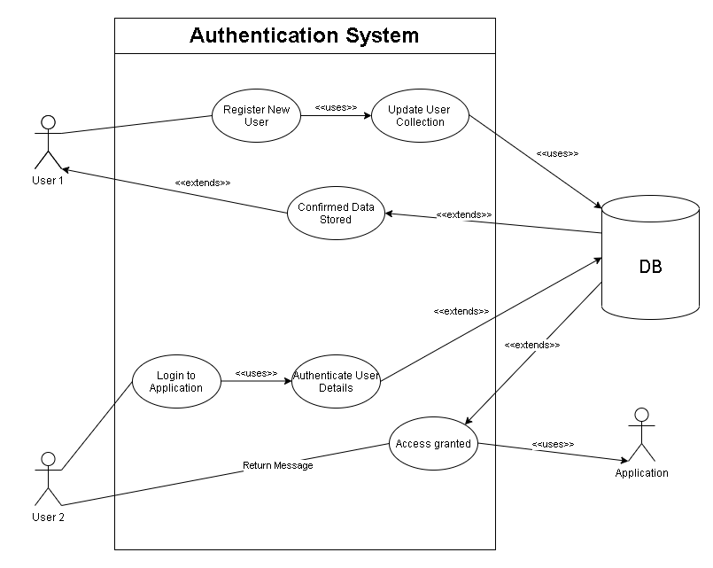

# LAB - 06
# basic-auth

### Author: Mohammad Za'areer

- [tests report](https://github.com/401-JS-Mohammad-Zaareer/api-server/actions)
- [front-end](https://api-server-mongodb.herokuapp.com/)

### Setup

#### `.env` requirements

- `PORT` - Port Number
- `MONGODB_URI` - Remote DB

#### Running the app

- `npm start`
- Endpoint: `/`
  - Returns JSON object

    ```javascript
    {
        "_id": "60a1d12132d53923dcd5b0f0",
        "username": "Ammar",
        "password": "$2b$10$TRkeunmYa8CRzZY0Y2TbzuQreZUI8SzolZTVE.5RHITOR4/tFm3C.",
        "__v": 0
    }
    ```
- Endpoint: `/signup`
  - Returns JSON object
  
    ```javascript
    {
        "_id": "60a1d12132d53923dcd5b0f0",
        "username": "Ammar",
        "password": "$2b$10$TRkeunmYa8CRzZY0Y2TbzuQreZUI8SzolZTVE.5RHITOR4/tFm3C.",
        "__v": 0
    }
    ```
#### Tests

- Unit Tests: `npm run test`
- Lint Tests: `npm run lint`

#### UML
